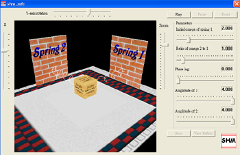
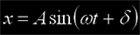

# Simple Harmonic Motion Simulator

   

This one simulates a box undergoing SHM driven by two springs.  An UI is given to input different parameters, such as mass of the box, spring constants and phase lag.  The calculation is based on a general analytical solution of SHM:

   

Moreover, it supports exporting the resulting locus of the box  to an image file for the educational use.